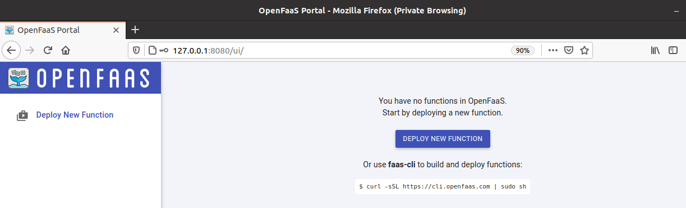

# Lab 1 - Prepare for OpenFaaS


## Cài đặt Docker

Cài theo script trên trang https://docs.docker.com/engine/install/ubuntu/

> Lỗi thiếu curl, cài đặt `sudo apt install curl -y`

```
curl -fsSL https://get.docker.com -o get-docker.sh

sudo sh get-docker.sh
```

Thêm `user` vào `group Docker`, nếu không mỗi lần sử dụng Docker phải kèm theo lệnh `sudo`

```
sudo usermod -aG docker your-user
```
> Sau lệnh **usermod** phải `logout` để áp dụng

Kiểm tra version cài đặt, chạy ứng dụng docker đầu tiên `hello-world`

```
docker -v

docker run hello-world
```


## Cấu hình Docker hub

- Đăng ký tài khoản ở đây: https://hub.docker.com/

- Login docker hub trên CLI

```
docker login
```


## Cài đặt Kubernetes

Cài theo hướng dẫn trên trang https://kubernetes.io/docs/tasks/tools/install-kubectl/

```
export VER=$(curl -s https://storage.googleapis.com/kubernetes-release/release/stable.txt)

curl -LO https://storage.googleapis.com/kubernetes-release/release/$VER/bin/linux/amd64/kubectl

chmod +x kubectl

mv kubectl /usr/local/bin/
```
> Thiếu quyền, cấp quyền `sudo mv kubectl /usr/local/bin/`

Kiểm tra version

```
kubectl version --client
```

## Tạo cluster trên Kubernetes

- Tạo cluster ở local

**k3s using k3d**

Cài k3d ở đây https://github.com/rancher/k3d

```
curl -s https://raw.githubusercontent.com/rancher/k3d/main/install.sh | bash
```

Tạo cluster (*)

```
k3d cluster create
```


- Cài đặt arkade

Cài arkade

```
curl -SLsf https://dl.get-arkade.dev/ | sudo sh
```

Chạy app OpenFaaS (*)

```
arkade install openfaas
```

```
bvt@ubuntu:~/Desktop$ arkade install openfaas
Using kubeconfig: /home/bvt/.kube/config
Node architecture: "amd64"
Client: "x86_64", "Linux"
2020/09/09 11:39:20 User dir established as: /home/bvt/.arkade/
https://get.helm.sh/helm-v3.2.4-linux-amd64.tar.gz
/tmp/linux-amd64 linux-amd64/
/tmp/helm linux-amd64/helm
/tmp/README.md linux-amd64/README.md
/tmp/LICENSE linux-amd64/LICENSE
2020/09/09 11:39:25 extracted tarball into /tmp: 3 files, 0 dirs (3.594277301s)
Downloaded to:  /home/bvt/.arkade/bin/helm helm
"openfaas" has been added to your repositories

VALUES values.yaml
Command: /home/bvt/.arkade/bin/helm [upgrade --install openfaas openfaas/openfaas --namespace openfaas --values /tmp/charts/openfaas/values.yaml --set gateway.replicas=1 --set ingressOperator.create=false --set queueWorker.replicas=1 --set queueWorker.maxInflight=1 --set basic_auth=true --set operator.create=false --set faasnetes.imagePullPolicy=Always --set basicAuthPlugin.replicas=1 --set serviceType=NodePort --set clusterRole=false --set gateway.directFunctions=true --set openfaasImagePullPolicy=IfNotPresent]
Release "openfaas" does not exist. Installing it now.
NAME: openfaas
LAST DEPLOYED: Wed Sep  9 11:39:32 2020
NAMESPACE: openfaas
STATUS: deployed
REVISION: 1
TEST SUITE: None
NOTES:
To verify that openfaas has started, run:

  kubectl -n openfaas get deployments -l "release=openfaas, app=openfaas"
=======================================================================
= OpenFaaS has been installed.                                        =
=======================================================================

# Get the faas-cli
curl -SLsf https://cli.openfaas.com | sudo sh

# Forward the gateway to your machine
kubectl rollout status -n openfaas deploy/gateway
kubectl port-forward -n openfaas svc/gateway 8080:8080 &

# If basic auth is enabled, you can now log into your gateway:
PASSWORD=$(kubectl get secret -n openfaas basic-auth -o jsonpath="{.data.basic-auth-password}" | base64 --decode; echo)
echo -n $PASSWORD | faas-cli login --username admin --password-stdin

faas-cli store deploy figlet
faas-cli list

# For Raspberry Pi
faas-cli store list \
 --platform armhf

faas-cli store deploy figlet \
 --platform armhf

# Find out more at:
# https://github.com/openfaas/faas

Thanks for using arkade!
```

## OpenFaaS CLI

```
curl -SLsf https://cli.openfaas.com | sudo sh
```
> Nếu đã cài đặt trước đó, bỏ qua bước này

## Triển khai OpenFaaS

- Đăng nhập Gateway (*)

```
kubectl rollout status -n openfaas deploy/gateway
kubectl port-forward -n openfaas svc/gateway 8080:8080 &
```

- Lấy password để đăng nhập (*)

```
PASSWORD=$(kubectl get secret -n openfaas basic-auth -o jsonpath="{.data.basic-auth-password}" | base64 --decode; echo)

echo -n $PASSWORD | faas-cli login --username admin --password-stdin

echo $PASSWORD
```

- Đăng nhập vào Web Portable `http://127.0.0.1:8080` của OpenFaaS với `admin/password`


Trang Web UI của OpenFaaS




## Noted

- Các bước có (*) là các bước quan trọng, khi khởi tạo một cluster lại thì phải trải qua các bước này.
- Thực hiện từng bước một (tạo cluster > chạy OpenFaaS bằng arkade > đăng nhập Gateway)

Done, now move onto lab2